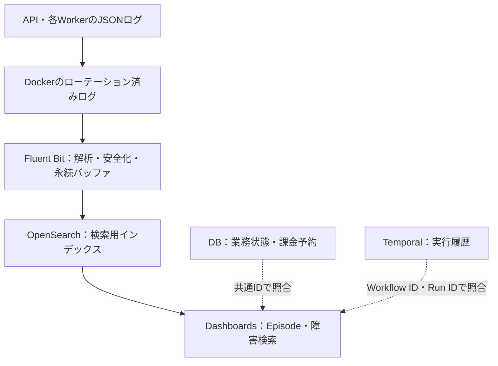

# OpenSearchログ設計

作成日：2026-09-30（日本時間）／対象：ai-video-platform-v2

Claude Codeへ渡す実行指示は、別ファイルの `OpenSearch_Claude_Code_Prompt.md` に分離する。

## 1. 設計の結論

**アプリの構造化JSONログ → Fluent Bit → OpenSearch → OpenSearch Dashboards**を最初の構成にする。

目的は、Episodeを指定すれば、企画・Research・台本・Storyboard・画像・動画・音声・Render・Uploadの経過と、シーン単位の失敗・復旧・外部API呼び出しを追えること。過去の403では保存されなかった診断情報を、安全な形式で残す。

この設計は会話で確認できた構成に基づく提案であり、現在のリポジトリや本番環境を実査した確定設計ではない。Claude Codeが現行コード・AGENTS.md・リソースを確認し、差異を設計書に反映してから実装する。古いブランチ名・commit・サービス一覧をそのまま基準にしない。

破線は調査時の照合関係であり、DBやTemporalからDashboardsへ自動同期する実装を意味しない。

## 2. 初期範囲と拡張

| 対象 | 今回実装するもの | 後から拡張するもの |
|---|---|---|
| Logs | 共通JSON形式、収集、検索、保存期限、障害試験 | 多ホスト収集、用途別インデックス |
| Metrics | Collectorの再送・破棄・バッファ状態、ログ基盤の状態を確認する手段 | Prometheus・Grafana、業務メトリクス |
| Traces | 実在するtrace_id・span_idを保持できる項目 | OpenTelemetryで計測し、Tempo等のバックエンドを選定 |
| Temporal | workflow_id・run_id・activity_id・attemptをログと結合 | Temporalのメトリクス・Traces連携 |

Data Prepper、Kafka、Tempo、Prometheusを今回まとめて新設する必要はない。既存の監視があれば再利用する。Data Prepperは複雑な変換やOTLP取り込みが必要になった時に再検討する。

**OpenSearchは検索用の副本。業務状態・課金・冪等性はDB、Workflowの実行履歴はTemporalを正とする。ログ検索結果で課金済みか判断したり、再実行を自動決定したりしない。**

## 3. ログ契約

既存loggingを活用し、追加ライブラリは必要性を確認して採用する。1イベントを1行のJSONにする。例外の改行はJSON文字列内にエスケープして保持する。

| フィールド | 意味・型 |
|---|---|
| @timestamp | 発生日時、UTC、date |
| ingested_at | 収集側の取り込み日時、date |
| schema_version | ログ契約の版、integer |
| event_id | 1回のログ発行を識別するID、keyword |
| event_name / level / message | 固定イベント名、レベル、説明。前2項はkeyword、messageはtext |
| service_name / environment / git_sha | サービス、環境、稼働コードの識別、keyword |
| episode_id / scene_id / scene_revision / stage | Episodeとシーン、改訂、処理段階。revisionはinteger、他はkeyword |
| workflow_id / run_id / activity_id / task_queue | Temporalとの照合、keyword |
| activity_attempt / provider_attempt | Activity再試行と実provider操作試行を区別、integer |
| request_id / correlation_id / trace_id / span_id | API・将来のTracesとの照合、keyword |
| provider / provider_operation / provider_request_id | 外部サービス、submit・poll・download等、外部ジョブID、keyword |
| paid_job_id / reservation_id | 現行台帳への参照。実コードの名前に合わせる、keyword |
| http_status / duration_ms | HTTP結果と処理時間、integer / double |
| error_type / error_code / error_category / retryable | 例外種別、providerコード、分類、再試行可否。最後のみboolean |
| response_excerpt / exception_stack | 安全化済みの診断情報、text、長さ上限あり |
| response_truncated / redaction_applied | 診断情報の切り詰め・安全化の有無、boolean |
| attributes | 安全化済みの補助情報。原則enabled:falseのobjectとし、自由なキーを検索項目にしない |

常に必須なのは日時・schema_version・event_id・event_name・level・message・service_name・environment。git_shaはビルドで供給し、不明ならunknownを明示する。Episode等は該当するイベントで必須とする。起動ログやインフラログに架空のEpisode・traceを作らない。

エラー分類は観測事実と推定を分ける。HTTP 403だけでcredentialsと断定しない。本文等に根拠がなければunknown／unclassifiedを残す。ログの分類追加によって既存のprovider再試行や422 fallbackの制御を変えない。

scene_idは既存の永続IDを使い、配列番号を代用しない。fallbackではscene_revisionや現行supersedeの参照も残す。予約IDやprovider IDは実際に取得できた時点から記録する。

### 記録するイベント

- サービス起動・停止、Schedule／日次枠の取得・スキップと理由。
- 各処理段階の開始・成功・失敗・blockedと理由。
- 外部APIの操作開始・結果、timeout、成否不明。submit、poll、downloadを区別する。
- 403・422・file_download_error、既存fallbackの開始・結果、resume、supersede。
- 課金予約の遷移を既存処理の境界で記録。DBコミット済みの確定状態と、変更試行を混同しない。
- Renderの尺・音声重複等の検証結果、Uploadの開始・結果・既存動画再利用。

pollやheartbeatを毎回INFOにしない。状態変化・間引き・DEBUGを使い、ログ量を制限する。成功済みシーン再利用を確認できるイベントを残す。

contextvars等でAPI／Activityに文脈を引き回し、処理終了時に必ず解除する。同時実行EpisodeのIDが混ざらないことを検証する。Workflowコード内ではTemporal SDKのreplay対応logger等を使い、OS時刻・通常乱数・ネットワークI/O・任意UUID生成を持ち込まない。event_idの生成もWorkflowの決定性を崩さない方式にする。

## 4. 安全な診断情報

秘密情報は**stdoutに出す前**に除外する。Collectorは追加の防御として働くが、Dockerログ・バッファに一度残った秘密を後段のマスクで消せるとは考えない。

- APIキー、Authorization、Cookie、OAuth token、秘密鍵、DB接続文字列を保存しない。
- 署名付きURLは署名・query・userinfoを除外する。パスにも秘密が含まれ得るため、host＋安全な操作名を基本にする。
- providerのresponseは許可したエラー項目・ヘッダだけを抽出。全文を無条件保存しない。
- response_excerptの暫定上限はUTF-8で4KiB。例外stackと1イベント全体にも上限を設け、切り詰めの事実を記録する。
- リクエストのプロンプト全文、画像・音声・動画・base64、環境変数のdumpは記録しない。既存artifact IDと安全なhashで参照する。
- Python例外文字列、httpクライアントや第三者ライブラリのDEBUGログにも秘密が入る点を検証する。
- 非構造化インフラログも安全化し、アクセス制限・短い保持期限を適用する。安全に処理できないログをそのまま隔離ファイルへコピーしない。

## 5. 収集経路と障害時の挙動

Docker Composeで動いていることを確認したうえで、現行logging driverを調査する。json-fileなら、対象コンテナのログをread-onlyでtailする経路が候補。local／journald／rootless Dockerなら対応する入力経路を選ぶ。driver変更が必要なら、対象サービスの再作成と影響を明示する。

Docker socketはread-onlyマウントでも権限が強いため、メタデータ取得だけを理由に無条件に渡さない。サービス識別はアプリ自身のservice_name等を基本にする。プロジェクト外のコンテナ、Collector自身の反復エラーログは通常のアプリ収集対象から除外する。

Fluent Bitには永続化したtail位置DBとfilesystem bufferを持たせる。Dockerの外側JSONと内側アプリJSON、分割行、例外、rotation、コンテナ再作成を扱う。再送間隔・メモリ・ディスク・ファイルサイズに上限を設定する。

**有限バッファでは「一切欠損しない」と「永久に業務を止めない」を同時に保証できない。** OpenSearch通信を業務リクエストの同期経路に入れず、停止時は有限のバッファで吸収する。上限超過時の破棄と欠損可能期間を監視・報告する。Docker stdout自体の詰まりも考慮し、non-blocking等を採用する場合はそのログ欠損条件を明記する。

Fluent Bitのstorage.total_limit_size超過では古いchunkが破棄され得る。単に永続化・無限retryを有効にするだけで耐障害性が完成したとしない。専用容量・上限・警告・復旧手順を合わせて実装する。

event_idをOpenSearch文書IDに使う候補を検証する。発行済みのevent_idは再送で変更しない。一方、Activityの実再試行は別イベントとして残す。文書IDによる重複抑制は同一インデックス内に限られるため、rolloverをまたぐ再送までexactly-onceと称さない。event_idで照合・重複除去できる検索例を用意する。

Bulk APIはHTTP 200でも個々の文書が失敗し得る。採用するFluent Bit版の実際の処理を確認し、429・5xx、型不整合等の恒久エラー、バッチ内の部分失敗を試験する。成功済みログの無制限再送や1件の不正ログによる永続詰まりを検知する。必要な隔離経路は安全化済み・容量制限・保持期限付きとし、プラグインに存在しないDLQ機能をあるものとして設計しない。

## 6. インデックスと保持

少量の初期運用ではサービス別・Episode別の日次インデックスを作らず、環境／用途別にまとめる。

| 項目 | 初期候補 |
|---|---|
| アプリ書き込みalias | avp-app-prod-write |
| 初期アプリindex | avp-app-prod-000001 |
| インフラindex系統 | avp-infra-prod-*（アプリと型・安全化方針を分離） |
| primary shard / replica | single-nodeなら1 / 0。高可用ではないことを明記 |
| rollover | 初期候補：5GiBまたは7日。実測・容量で調整 |
| アプリ保持 | rollover後14日を候補。イベント単位の厳密な14日ではない |
| インフラ保持 | より短い期間を候補に容量試算して決める |
| DEBUG | 通常無効。限定時間・限定対象で有効化 |

ISMのrollover・delete、index template、mapping、初期write indexとaliasを冪等にbootstrapする。ISMの時間条件とイベント日時は異なる。候補の「最大7日でrollover、rollover後14日で削除」なら、通常は記録時点によって約14〜21日＋ISM実行遅延の保持となる。cluster停止中の遅延等もあり厳密な上限ではない。厳密な削除期限が必要なら設計を見直す。

自由なresponse JSONをdynamic mappingに展開しない。検索対象は明示mapping、補助情報はattributesへ。未知フィールドの扱いと型不整合の検知をログ契約に定める。bootstrap時に意図しないindex auto-createやalias名の実index化を防ぐ。全indexを対象にする削除・ISM適用は行わない。

保存量は「安全化後の平均bytes × events/日 × 実際の保持日数 × 実測したindex倍率 ＋ バッファ ＋ 余裕」で試算する。倍率を事実として決め打ちしない。検索領域はSSDを候補、MinIOの動画データと同じディスクならI/O・空き容量の競合を評価する。mount不成立のまま空ディレクトリに書く起動も防ぐ。

## 7. 検索・運用

Dashboardsに検索ビューと以下の保存済み検索／パネルを作る。版ごとにUIの名称・import形式を確認する。

1. Episode単位の時系列と、stage別の開始・結果。
2. scene_id・revisionごとの403／422／fallbackとprovider_request_id。
3. service_name・git_sha一覧で版混在を確認。
4. blocked、Render失敗、Upload失敗の一覧。
5. Collectorの再送・破棄・バッファ使用量、index容量、ingestion lagの確認手段。

ログの並びは日時だけで因果関係を断定せず、ID・attempt・revisionも照合する。「ログなし」は未実行・収集停止・バッファ待ちを区別できない。日次動画の未生成は既存DB・Temporalの読み取りと照合する運用手順を用意する。

失敗検知をOpenSearch内だけに依存させない。既存監視または軽量な独立ヘルスチェックから、OpenSearch到達性・最終取り込み・Collectorの状態を確認できるようにする。ログ基盤は再実行や投稿操作をしない。通知先の接続や外部送信は今回の必須範囲にしない。

## 8. 実行環境と導入手順

OpenSearchとDashboardsは互換性が確認できた具体的version／digestを固定し、latestを使わない。TLSと認証を有効にし、Collectorは対象indexへの必要最小権限、閲覧者は読取権限、bootstrapだけ管理権限に分ける。本番でデモ証明書・既定ユーザーを恒常利用しない。開発用の認証省略を本番設定に混ぜない。9200・5601はloopbackまたは認証済みの非公開経路に限定する。

ホストのRAM・swap・CPU・空き容量・現行サービスの消費を実査する。以前の約16GB／swap逼迫という情報は現行状態として断定しない。暫定の検証用候補はOpenSearch heap 1GiB・コンテナ上限2〜3GiB、Dashboards 512MiB〜1GiB、Fluent Bit 128〜256MiB。これは性能保証でも、公式最低要件でもない。heap以外のnative memory・page cache・既存ワークロードを含めて判断し、足りなければログ基盤を別ホストへ分離する。bootstrap要件とvm.max_map_count等も確認する。

1. 現行調査とADR／ログ契約の作成。
2. 独立レビュアーが設計をレビューし、重大指摘を解消。
3. JSONログ・Collector・OpenSearch・Dashboardsを隔離環境で実装。
4. fake providerで正常系・異常系と課金安全性の回帰を確認。
5. 独立レビュー、指摘修正、修正箇所の再レビュー。
6. 再現可能な起動・停止・復旧手順と段階導入／rollback手順を準備。

この依頼ではClaude Codeに設計・実装・隔離検証・commitまでを任せる。本番への導入、Schedule変更、実providerの有料呼び出し、YouTube投稿、pushは別途の明示指示がある場合に行う。

## 9. Claude Codeの報告をこのチャットでレビューする場合

報告と設計書・変更差分を提示すれば、設計の整合性と検証根拠を追加レビューできる。報告文だけから実装の正しさを確定しない。最低限、以下を含める。

- ADR／ログ契約、収集・ISM・mapping設定、代表的な安全化済みログ。
- git diff --statと主要差分、base commitとHEAD。
- 検索結果まで到達した試験証拠、停止・復旧・欠損試験の結果。
- 独立レビューの指摘一覧と再確認結果、未検証事項。

## 10. 設計確認に用いた一次資料

実装時には採用した具体的versionの公式資料と設定名を再確認する。

- OpenSearch Docker導入・heap・永続化・初期認証：https://docs.opensearch.org/latest/install-and-configure/install-opensearch/docker/
- OpenSearchログ取り込みの構成例：https://docs.opensearch.org/latest/observing-your-data/log-ingestion/
- ISMの概要：https://docs.opensearch.org/latest/im-plugin/ism/index/
- ISM時間条件：https://docs.opensearch.org/latest/im-plugin/ism/policies/
- ISM rollover例：https://docs.opensearch.org/latest/im-plugin/ism/policies-examples/
- Fluent Bit OpenSearch出力：https://docs.fluentbit.io/manual/data-pipeline/outputs/opensearch
- Fluent Bit tailと位置DB：https://docs.fluentbit.io/manual/data-pipeline/inputs/tail
- Fluent Bitバッファと上限時の破棄：https://docs.fluentbit.io/manual/data-pipeline/buffering
- Temporalの決定性：https://docs.temporal.io/workflow-definition

Fluent Bitの有限バッファ、OpenSearchのISM、Temporalの決定性は公式仕様に基づく。それ以外の容量・保持期間・初期構成はこのプロジェクト向けの提案であり、実測とレビューで確定する。
