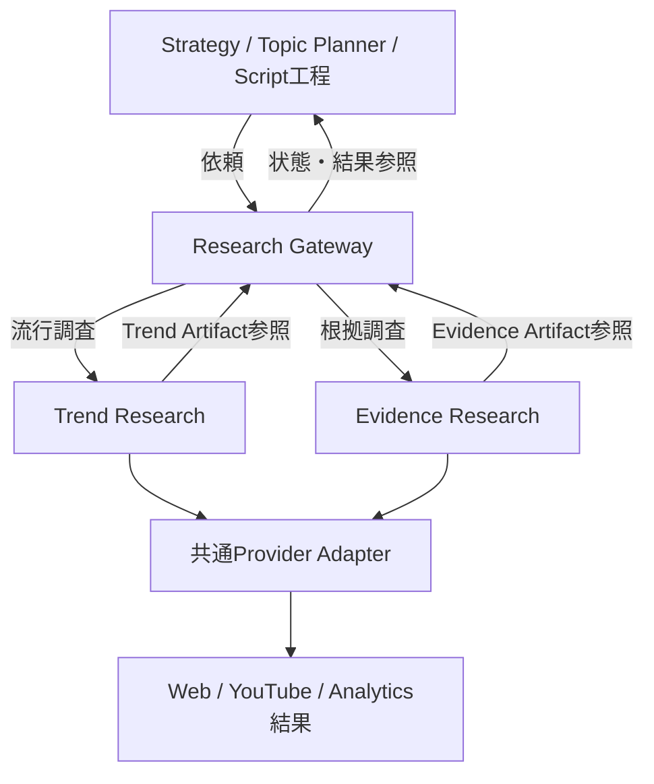
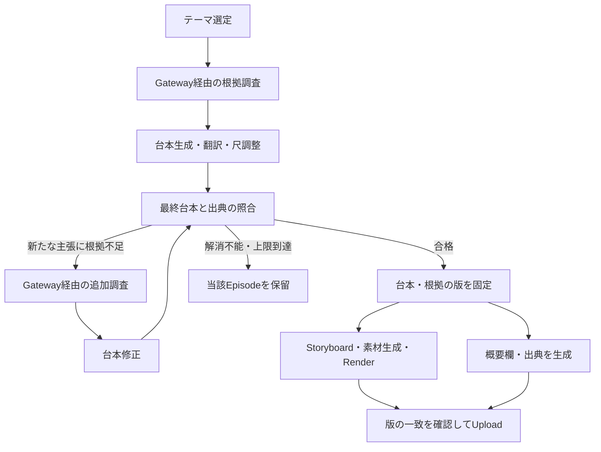

# AI Video Platform v2 — Research機能設計書

版: 0.1（設計案） / 作成日: 2026-09-21

## 1. 結論と前提

Researchを共通の調査機能として設け、その内部に「Trend Research（流行調査）」と「Evidence Research（根拠調査）」を配置する。利用側はResearch Gatewayに依頼し、確定した調査結果を受け取る。戦略・企画・台本ごとに別々の検索機構は作らない。

調査は意思決定の材料を提供する。戦略の決定はStrategy、動画テーマの選定はTopic Planner、台本の執筆はScript Writerが担当する。

本書は新規機能の提案であり、実装済みの仕様ではない。参照した2026-09-13付の方式設計書にある、Temporal・PostgreSQL・MinIO・Job・Artifact・外部呼出予約の原則に合わせる。同書のPhase進捗は現在の実装状況の証拠として扱わない。実装前に現在のリポジトリと詳細設計・DB制約を照合する。

## 2. 要件

| 区分 | 要件 | 利用者・利用先 |
|---|---|---|
| 流行調査 | 最近注目されているテーマ、関連動画、話題の背景を調べる | Strategy / Topic Planner |
| 根拠調査 | 歴史の主張を裏付ける資料と該当箇所を調べる | Script Writer / 台本検証 |
| 出典掲載 | 最終的な動画の内容に対応した資料を概要欄へ掲載する | 投稿メタデータ生成 / Upload |
| 共通 | 調査日時・検索条件・出典・不明点を残す | 再調査 / 監査 / 改善 |
| 継続運用 | 障害・予算超過・根拠不足の扱いを分け、無限に再試行しない | Orchestrator |
| 拡張性 | 日本語・英語、Shorts・長尺、検索プロバイダ追加に対応する | 全体 |

対象視聴者は米国20代を初期設定とするが、地域・言語・年齢・動画形式は設定値として渡す。検索結果だけから「米国20代に人気」と断定しない。

## 3. 構成と責務

この図は論理上の依頼・結果経路を示す。実際の実行はTemporalが制御する。Artifactは保存されたデータであり、検索を実行したり他の機構を呼び出したりしない。

| 構成要素 | 責務 | 担当しないこと |
|---|---|---|
| Research Gateway | 依頼検証、権限・予算方針、キャッシュ判定、実行受付、結果参照の返却 | 長時間の同期処理、企画の最終決定 |
| ResearchWorkflow | 工程順序、待機、期限、再試行、完了・部分完了・停止の制御 | Workflow内での外部通信 |
| Research Worker | 検索、本文取得、評価、構造化、検証、成果物保存のActivity | 他Workerの直接呼出、Episode全体の制御 |
| Trend Research | 観測データと解釈を分けて流行候補を整理 | 人気を歴史的事実の根拠にすること |
| Evidence Research | 主張と資料の対応、反証、不確実性を整理 | 資料にない事実・URLの補完 |
| Provider Adapter | Web検索・本文取得・YouTube検索・統計・既存Analytics成果物の読み取り | 各利用者固有の戦略判断 |
| 投稿メタデータ生成 | 最終台本に対応する出典を概要欄へ整形 | 新規調査や根拠の創作 |

初期配置は同一リポジトリ内の1つのResearchモジュールと1種類のResearch Workerとする。2種類の調査を別サービスとして運用する必要はない。負荷が増えた場合に同じ契約のままTask Queueを分けられる構成にする。

### 呼出方式

- Web UIなどの外部利用者: FastAPIで受付し、重複防止キー付きで非同期実行を開始する。受付時はrequest_idを返す。
- 既存制作Workflow: 共通のGateway契約で依頼を構成し、Temporalの子WorkflowとしてResearchを実行する。自分のFastAPIへのHTTP呼出は行わない。
- StrategyやScriptのWorkerが不足情報を発見した場合: `research_needed` と質問を返す。親WorkflowがResearchを起動し、結果を渡して当該工程を再開する。
- Gatewayが返すArtifact参照を使い、共通Artifact取得層から本体を読む。大きな結果をTemporal履歴に埋め込まない。
- 台本生成用LLM自身による制御外のWeb検索は無効化し、検索が必要なら共通経路へ返す。

## 4. Trend Research（流行調査）

### 入力

対象地域、視聴者仮説、出力言語、分野、検索期間、検索語、動画プロファイル、既存戦略の版、過去動画の参照、利用可能なAnalytics参照、最大取得件数・費用・期限。

「最近」は実行時に絶対期間へ展開して記録する。初期案は直近7日と直近30日を使い分ける。日本史のような長期的テーマも候補に含める。

### 処理

1. 日本史そのものと、関連する映画・ゲーム・展示・ニュース等の検索語を組み立てる。
2. YouTube検索とWeb検索から候補を集める。URL、検索語、検索日時、対象期間を保存する。
3. 取得可能な動画統計を観測日時付きで記録する。
4. 同じ動画の複数時点の観測があれば、再生数差分を時間差で割って増加速度を計算する。
5. 複数時点の観測がなければ、累積再生数÷公開後時間を参考値として使えるが、「直近の伸び」とは表記しない。
6. チャンネル規模、公開後期間、動画形式、同一チャンネルへの偏りを考慮して比較する。比較データがない場合は不明とする。
7. 観測事実、人気理由の仮説、日本史動画への企画案、不確実性を分けて出力する。

### 出力: Trend Artifact

| 項目 | 内容 |
|---|---|
| request_id / schema_version | 依頼・形式の識別 |
| observed_at / window / fresh_until | 観測日時、対象期間、利用上の鮮度期限 |
| queries / providers / coverage | 調べた範囲と取得できなかった範囲 |
| candidates | テーマ候補、参考動画・ページ、公開日 |
| observations | 取得値、単位、観測日時、比較対象 |
| interpretations | 注目理由の仮説とそれを支える観測ID |
| suggested_angles | チャンネル向けの切り口案 |
| limitations | サンプル不足、地域・年齢の不明、形式判定の不確実性 |

候補の評価は「伸びの観測」「テーマ適合」「過去動画との差分」「根拠資料を集めやすいか」を個別に提示する。初期実装で説明できない総合スコアやLLMの自称信頼度は採用しない。

### 米国20代を対象にする際の制約

YouTube検索の `regionCode=US` は米国で視聴できる動画を指定するもので、米国視聴者に人気であることを保証しない。`relevanceLanguage=en` も英語以外を完全排除しない。`videoDuration=short` は4分未満の検索条件であり、YouTube Shortsの確定判定には使わない。[YouTube Search API](https://developers.google.com/youtube/v3/docs/search/list)

自チャンネルの地域・年齢の分析は権限のあるAnalytics結果を別途利用する。年齢区分は18–24、25–34などであり、20–29歳を正確に切り出した値とは扱わない。取得可能なレポートの組合せに従い、欠損を0とみなさない。[Analyticsのディメンション](https://developers.google.com/youtube/analytics/dimensions)、[チャンネルレポート](https://developers.google.com/youtube/analytics/channel_reports)

したがって「米国20代向けに試す価値がある」という仮説を作り、投稿後の自チャンネルの実績で検証する設計とする。

### 起動タイミング

戦略の見直し時と定期更新時に実行する。初期案は日次更新。日々の動画制作は確定済みの調査結果を使うため、毎回最新調査の完了を待つ必要はない。明示的に鮮度必須の依頼だけ待機する。

## 5. Evidence Research（歴史の根拠調査）

### 調査対象

テーマだけでなく、確認したい主張を短い単位に分解する。年代、人物、場所、出来事、比較、数量、因果関係を区別する。「ある出来事が起きた」と「その出来事のために流行した」は別の主張として調査する。

資料は、公文書・博物館・大学・研究機関・査読論文・専門書など、主張に適した出典を優先する。一次資料は当時の記述を示す証拠として扱い、それだけで現代的な因果関係を断定しない。解釈には専門研究も使う。

一般記事やWikipedia等は探索の手掛かりとして利用できるが、重要な主張については引用元へ遡る。検索結果の抜粋だけを読んで「本文確認済み」としない。複数サイトが同じ資料を転載している場合は独立した裏付けとして数えない。

### 処理

1. テーマ・確認したい主張から日英の検索語を作る。
2. 資料候補を検索し、本文・該当ページを取得する。
3. 主張を支持・限定・否定する箇所を抽出する。
4. 年代・地域・対象・用語・因果関係の範囲が主張と一致するか評価する。
5. 反証や異説があれば併記する。裏付けられない点も明示する。
6. 台本で使える表現と、避けるべき表現を返す。

### 出力: Evidence Artifact

| 要素 | 必須情報 |
|---|---|
| claim | claim_id、主張本文、対象時代・地域、重要度 |
| source | source_id、実際に取得したURL、資料名、著者・発行元、分かる場合は公開・更新日 |
| source_version | 取得日時、内容hash、本文取得状態、保存参照または短い根拠抜粋 |
| evidence_link | claim_id、source_id、該当ページ・節・段落、短い根拠箇所、支持・限定・反証の区分 |
| assessment | supported / qualified / disputed / insufficient、理由、使える表現 |
| gaps | 未確認の論点、本文取得不能、追加調査候補 |

`supported` は定めた確認基準を満たすという意味であり、歴史的真実の絶対保証ではない。LLMによる意味評価には誤りがあり得るため、異説のある中心主張はレビュー対象として残す。

### 採用ルール

- 台本に残す検証可能な歴史の主張は、原則としてすべて出典と対応させる。
- 通常の主張は、直接裏付ける適切な資料を最低1件確認する。
- 強い因果関係、数量、最初・唯一などの断定、異説のある中心主張は、独立した資料による照合を要求する。十分でなければ限定表現へ変更するか削除する。
- qualifiedは根拠が支える範囲の表現だけ利用する。disputedは異説として紹介する場合に限り使う。
- insufficientの主張を確定事実として採用しない。
- 創作のせりふ・視覚的な演出は史実と分ける。根拠なしに実在人物の発言として紹介しない。

## 6. 動画制作への組込み

初回はテーマの根拠調査を先に行い、その成果物を使って台本を生成する。生成後には最終表現を確認する。二度の確認は同じEvidence Research機構の用途であり、別システムではない。

初期の追加調査・修正ループ上限は2巡の案とする。外部通信の一時障害のretryとは別のカウンタを持ち、合計費用と期限も制限する。

Script Contractには、少なくともシーン・ナレーション等とclaim_idの対応を追加する。タイトル、冒頭の煽り文、画面テキスト、概要欄本文に含む歴史の主張も検証対象とする。執筆者が付けたclaim_idだけを信用せず、検証工程でも未登録の主張がないか照合する。

翻訳や短縮で「一部の人々」が「全員」になる等の意味変化を防ぐため、英語化・尺調整後の文面で確認する。確定後に事実表現が変わった場合は、該当範囲を再検証する。

### 概要欄への掲載

投稿メタデータ生成は、最終台本で使われたclaim_idから資料を選択し、重複を除いて「Sources / Further reading」を生成する。主張とsourceの対応は内部に保持する。

掲載形式は「資料名 — 発行元」「裏付ける内容の短い説明」「URL」を基本とする。日本語資料の場合は原題を残し、英語の説明と資料言語を補足する。削除した主張の資料は自動的に掲載候補から外す。

URL・書誌情報は取得済みのsourceから決定的に整形し、LLMに生成させない。概要欄の長さ上限を検証し、超える場合は説明文を短くし、同一資料を統合する。必須出典を切り捨てて成功扱いにしない。

保存物は、最終台本・Evidence・検証結果の固定参照を持つ投稿メタデータArtifactとする。Uploadはこれを使用し、その場で最新の出典へ差し替えない。公開済み動画の概要欄も自動更新しない。

## 7. 共通インターフェースとデータ管理

### ResearchRequestの論理契約

| フィールド | 意味 |
|---|---|
| request_id / idempotency_key | システムが付与する依頼ID・重複防止キー |
| kind | trend または evidence |
| requester / channel_id / episode_id | 利用元、対象チャンネル、必要な場合のEpisode |
| question / claim_inputs | 調査目的と確認対象 |
| audience / language / format_profile | 対象視聴者、言語、動画形式 |
| time_window / as_of | 絶対的な調査期間・基準日時 |
| input_artifact_refs | 戦略、台本、Analytics等の固定版参照 |
| limits | 費用、API割当、取得件数、期限、再調査上限 |
| policy_version / schema_version | 評価方針と契約の版 |

trend/evidence固有の項目は型を分けて検証する。任意フィールドだらけの単一JSONにしない。

### ResearchResultの論理契約

`request_id / execution_status / artifact_refs / coverage / warnings / usage / freshness` を返す。

実行状態は queued / running / completed / partial / blocked / failed の案とする。完了した調査が「根拠なし」という結論になることもあるため、実行状態とclaimの評価は独立させる。partialを単純に合格とは扱わず、利用側が必要項目の充足を確認する。

### 永続化

- PostgreSQL: ResearchRequest、関連Job、実行状態、費用・割当、Artifactメタデータ、関連付けの正本。
- MinIO: Trend / Evidence / 検証結果 / 投稿メタデータのJSON、許容される資料抜粋等の本体。
- Temporal: 実行制御。DBの状態に代わる業務状態の正本にはしない。

初期案はResearchRequestを1テーブル追加し、Job・Artifact・provider reservationは既存機構を拡張して再利用する。claim・sourceの詳細はまずArtifact内に置き、検索要件が明らかになるまで多数の専用テーブルを増やさない。

戦略調査はEpisodeなしで存在する。既存Job/ArtifactがEpisode必須なら、ResearchRequestを所有者にできる関連を追加する。架空のEpisodeを作って流用しない。所有者はEpisodeかResearchRequestのどちらか一方という制約を設計する。

Artifactの「現行1件」制約はResearchの所有者・種別を含む範囲で定義する。複数Episodeは同じ確定済みEvidenceを参照でき、内容を複製して別の正本を作らない。

依頼受付のDB保存とWorkflow開始の間で停止しても依頼が消えないよう、request_idから決まるWorkflow IDと開始処理の再照合を使う。未開始の依頼を回復できる仕組みは既存の起動方式に合わせて実装する。

成果物は内容を検証してMinIOへ保存し、読み戻し・hashを確認した後、DBでArtifact登録と完了状態を確定する。保存途中の成果物を利用側へ返さない。DB確定前に停止した場合は同じobjectを照合して回復し、孤立objectは後から回収する。

### 再利用と更新

- request_hash: 種別、質問・主張、対象、期間、入力Artifact hash、評価方針・プロンプト・契約・Provider設定の版から計算する。
- 同じ呼出のretryではキーを変えない。Temporal attemptを含めない。
- 流行調査は同じ期間でも観測時刻が変わるため、日次等の更新枠を含め、古い結果への永久固定を防ぐ。
- 初期鮮度案はTrend 24時間、障害時に利用できる過去結果は7日まで。時事性必須なら過去結果を採用しない。
- Evidenceの再利用判定には、主張の同一性、資料の取得状態、評価方針の版を含める。30日等の再確認期限を設定できるが、期限は史実そのものの有効期限ではない。
- 制作途中・公開済みの成果物は固定版を参照する。新しい調査結果で無断差し替えしない。

外部データの保存・再取得条件はProvider別の保持ポリシーで管理する。キャッシュの鮮度期限とデータ保持期限は別物とし、保存できない本文を無期限に保持する前提は置かない。

## 8. 障害・費用・安全性

| 状況 | 挙動 |
|---|---|
| Trend取得失敗 | 許容期間内の過去結果を日時付きで利用。なければ既存戦略・通常テーマで企画 |
| 根拠検索の一部失敗 | 調査済み資料の範囲で評価し、未取得部分を明記 |
| 根拠不足・反証あり | 主張を限定・削除・再調査。中心主張を解消できなければ当該Episodeのみ保留 |
| 429・通信断 | 期限と予算内で回数制限付きretry |
| 認証失敗・割当枯渇 | 無限retryせず理由を記録して停止または部分結果を返却 |
| 課金処理の成否不明 | 予約とProvider照会で照合。確認できなければ無条件再発行しない |
| 資料URLの消失 | 新しい動画では代替根拠を探す。公開済み動画は修正候補として記録 |
| 台本と出典の版不一致 | Uploadせず投稿メタデータを再生成・検証 |

外部呼出の前にDBへ費用・割当予約を確定する。金額上限とAPI割当上限は別に管理する。初期の件数上限案は1依頼につき検索5回、本文取得10件。金額・トークン上限はProvider確定後に設定し、未設定なら実Provider実行を受け付けない。

上限は論理検索単位だけでなくページ取得・retry・追加調査を含めて数える。既存の動画生成用予算と合算できる日次上限も持つ。API単価・割当方式は設定化し、本書に固定値として埋め込まない。

外部ページは調査データとして扱い、ページ内の命令を実行しない。本文取得では内部ネットワーク・localhost・資格情報へのアクセスを禁止し、リダイレクト先も検証する。本文サイズと時間を制限し、資格情報付きURLを出典に出力しない。

LLM出力の型検査と意味検査を分ける。資料名・URL・抜粋の実在は取得データとの照合で検証する。source_idとclaim_idの参照整合性、空の根拠、未確認資料の誤使用はコードで拒否する。

## 9. 実装順序

1. **契約と共通基盤**: ResearchRequest、Gateway、Workflow、Fake Provider、Job/Artifactの所有関係を整備する。
2. **根拠調査から概要欄まで**: Web検索1種類、本文取得、claim-source対応、最終台本検証、概要欄生成を接続する。
3. **流行調査**: YouTube検索・公開統計・Webの話題を集め、Strategy/Topic Plannerへ渡す。定期更新と障害時の代替を追加する。
4. **運用を見て拡張**: 観測差分、自チャンネルAnalyticsとの比較、追加Provider、管理UIを追加する。

初期実装では専用マイクロサービス、Redis、ベクトルDB、常時自律探索する複数エージェントは導入しない。まず共通Research機構を既存基盤に接続する。

## 10. 受入条件

| 検証 | 合格条件 |
|---|---|
| 共通窓口 | 各利用元からの調査が同じ契約・予算・保存経路を通る |
| 調査成果 | Trendには日時付き観測、Evidenceには主張と該当資料の対応がある |
| 捏造防止 | 未取得URL、存在しないsource_id、存在しない根拠抜粋を拒否する |
| 意味の適合 | 年代の違い、対象範囲の拡大、因果の飛躍、異説を含む固定評価セットで誤採用を検出する |
| 最終表現 | 翻訳・短縮で意味が変わった台本をそのまま合格にしない |
| 出典の連動 | 台本から主張を削除すると不要な出典が掲載対象から外れる |
| 障害分離 | Trend停止でも通常企画は進み、根拠不足のEpisodeだけが保留される |
| 再開と課金 | 同一依頼の重複送信・Worker再起動で確定済み呼出を不用意に繰り返さない |
| 費用制御 | retry・追加調査を含む予算・割当・期限の上限を超えて実行しない |
| 版管理 | 台本・根拠・投稿メタデータの参照が固定され、再実行でも追跡できる |
| 拡張性 | 日本語・英語、Shorts・長尺で同じ契約を使える |

通常テストは固定資料とFake Providerで行う。実Providerの確認は少数の依頼と明示した上限で実施する。自動評価の合格をもって歴史的正確さの完全保証とはしない。

## 11. 実装着手前に確定する事項

方式は本書で提案済み。具体実装では次の4点を現在のコードと照合して確定する。

1. 現行Job/ArtifactのEpisode依存と、ResearchRequest追加時のmigration。
2. 利用する検索Provider、本文取得手段、予算・割当・保持条件。
3. Script Contractの現行版と、claim参照・最終検証結果を追加する移行方法。
4. Uploadが読む投稿メタデータの現行契約と、出典込みの版固定方法。

設計上の重要な判断は「窓口は共通」「調査目的は2種類」「調査結果と意思決定を分ける」「最終台本から出典を作る」「流行不足と根拠不足で継続方針を変える」の5点である。
